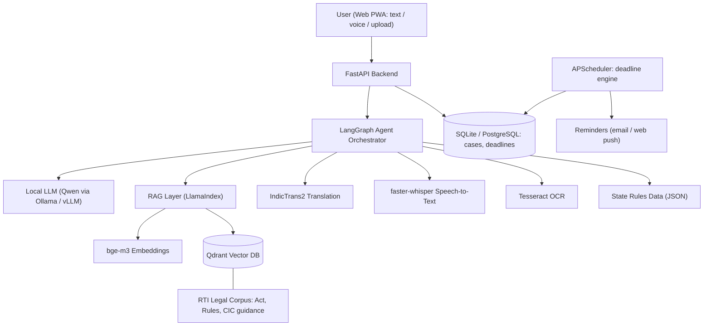
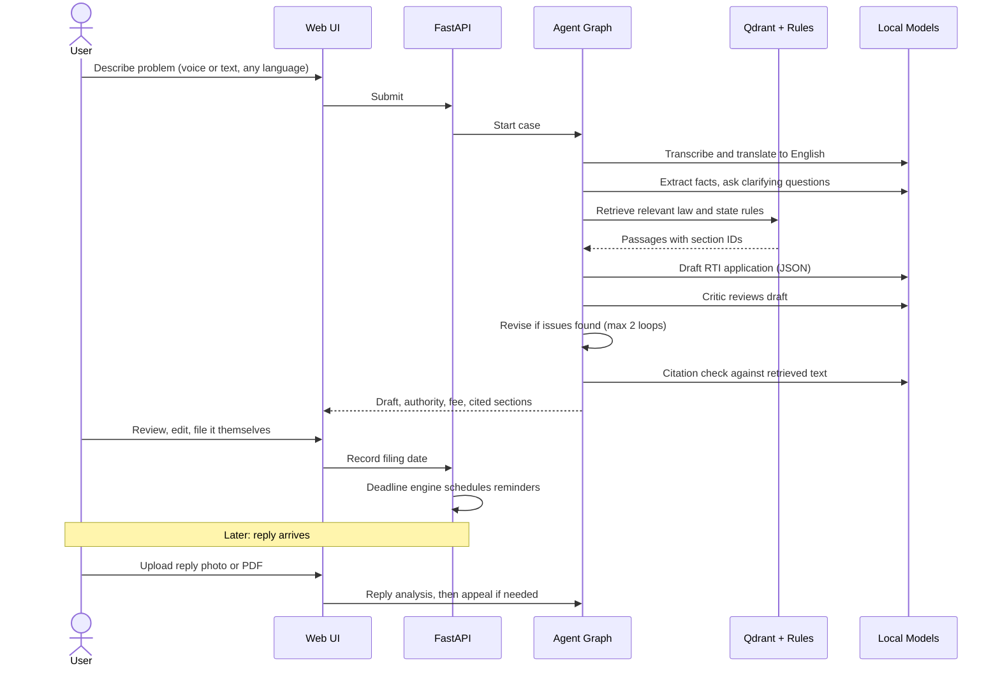
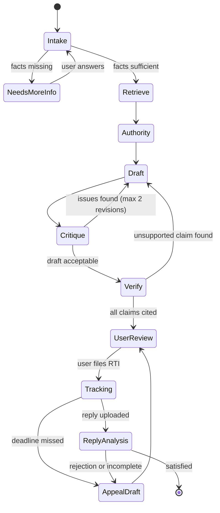

# 1. Project Name

## RTI Copilot
**A self-hostable, open-source AI agent system that takes an Indian citizen from "I have a problem with a government office" to a correct RTI application, a tracked legal deadline, and a ready appeal, in their own language.**

> Hacktoberfest | Open Source AI Hackathon, Qualifier Round submission
>
> Team: **[Team Name]** | Members: **[Names]**

> ⚠️ RTI Copilot is an information and drafting tool, **not a lawyer**. It never files anything on a user's behalf, and every output is reviewed by the user before use.

---

# 2. Problem Statement

The Right to Information Act, 2005 lets any Indian citizen demand information from public authorities: why a pension is stuck, where road funds went, why a ration card was rejected. It is one of the most powerful accountability tools in the country, yet most people never use it, or give up halfway. The barrier is **not the law. It is the process around it.**

| Barrier | What happens in practice |
|---|---|
| **Wording** | Vague requests ("tell me about my pension") are rejected or answered with nothing useful. |
| **Wrong authority** | Every department has its own Public Information Officer (PIO). Sending the request to the wrong one costs weeks. |
| **Rules vary** | Fees, formats, and payment methods differ between the Centre and each state. |
| **Silent deadlines** | The PIO must reply within a statutory window. Applicants rarely track it, and miss their right to appeal. |
| **Confusing rejections** | Replies cite exemptions like "Section 8(1)(j)" with no explanation, and people assume it's final. |
| **Language** | Formal English drafting excludes the very people who need the Act most. |

Today's options are poor. Government portals assume prior knowledge, paid agents are costly, and generic chatbots give general advice but produce nothing usable and never follow up. **No tool covers the full lifecycle (drafting, routing, tracking, reply analysis, and appeal) in regional languages while keeping a citizen's sensitive grievance private.**

---

# 3. Project Overview

RTI Copilot is a multi-agent, retrieval-grounded system built entirely on open-source AI components. A user describes their problem by text or voice. A team of specialised agents then:

1. Understands the grievance and asks clarifying questions.
2. Retrieves the relevant provisions of the RTI Act, rules, and past Information Commission guidance.
3. Drafts a precise application and critiques it for common rejection causes.
4. Suggests the correct authority and fee for the user's state.
5. Tracks the legal deadline and prepares the next step (appeal) if needed.
6. Explains any reply or rejection in plain language.

All AI runs on **open-weight models served locally**. No user data ever needs to leave the machine, which matters because RTI grievances can involve corruption, benefits, and personal records.

---

# 4. Proposed Solution

A **LangGraph-orchestrated agent pipeline** over a **RAG knowledge base of the RTI legal corpus**, using open-weight LLMs, multilingual embeddings, and Indic-language translation and speech models.

Key design principles:
- **Grounded, not guessed.** Every legal explanation must cite retrieved text. If retrieval finds nothing relevant, the system says so.
- **Structured, not free-form.** Agents produce schema-validated JSON (questions, authority, deadlines, cited sections) that the UI renders.
- **Human-in-the-loop.** The user reviews and files everything themselves.
- **Rules as data.** State-specific fees and formats live in a versioned data file, not hidden in prompts.
- **Self-hostable.** One `docker compose up` for NGOs, legal-aid clinics, and colleges.

---

# 5. Objectives

1. Let a first-time user produce a valid, well-formed RTI application in **under 5 minutes**.
2. Support **English plus at least Hindi and Marathi** end to end (input, drafting, explanation).
3. Make every legal statement **traceable to a source passage** in the Act or rules.
4. Never let a statutory deadline pass unnoticed: automatic tracking and reminders.
5. Help users respond to rejections and non-replies with a **correct first appeal draft**.
6. Run on **modest hardware** (a laptop or a single free-tier GPU) with a quantized model.
7. Keep all user data **local, minimal, and deletable**.

---

# 6. Target Users / Use Case

| User | Real situation |
|---|---|
| **First-time citizens** | Delayed pension, rejected ration card or certificate, stalled land record, unexplained bill. |
| **Students and applicants** | Exam marks, evaluation, or recruitment results never explained. |
| **Farmers and small business owners** | Pending subsidies, permits, or compensation. |
| **NGOs, legal-aid volunteers, local activists** | Helping many people file and track RTIs. This is the high-leverage self-hosting use case. |
| **Journalists and researchers** | Structured requests for public records with deadline tracking. |

**Primary persona:** *Sunita, a farmer's daughter in Maharashtra, whose father's crop-compensation payment has been "under process" for 8 months. She has never filed an RTI. She speaks Marathi and some Hindi. She describes the problem by voice, gets a Marathi explanation of what an RTI can ask, an English draft ready to submit, a reminder at day 30, and an appeal draft if there is no reply.*

---

# 7. Open-Source AI Technology Selected

| Role | Component | Licence |
|---|---|---|
| **Reasoning, drafting, analysis (LLM)** | **Qwen3-8B / Qwen2.5-7B-Instruct** (primary), 4-bit quantized. Alternatives benchmarked on our eval set: Llama 3.x 8B, Gemma 3. | Apache 2.0 (Qwen) |
| **LLM serving** | **Ollama** (llama.cpp) for local use; **vLLM** for a GPU deployment | MIT / Apache 2.0 |
| **Embeddings** | **BAAI/bge-m3** (multilingual, long-context) | MIT |
| **Vector database** | **Qdrant** | Apache 2.0 |
| **RAG framework** | **LlamaIndex** | MIT |
| **Agent orchestration** | **LangGraph** | MIT |
| **Indic translation** | **IndicTrans2** (AI4Bharat) | MIT |
| **Speech to text** | **faster-whisper** (Whisper) | MIT |
| **OCR for uploaded replies** | **Tesseract** (with Indic language packs), optional vision-language model for hard scans | Apache 2.0 |
| **Constrained structured output** | **Pydantic** schemas with JSON-guided decoding | MIT |

---

# 8. Why This Technology Was Selected

The choice is driven by the problem, not by popularity.

| Requirement from the problem | Why open-source AI is the right answer |
|---|---|
| **Privacy of grievances** (corruption complaints, benefits, personal records) | Local open-weight models mean data never leaves the user's machine or the NGO's server. A hosted API cannot offer this. |
| **Auditable, grounded legal output** | Self-managed RAG over the actual Act text lets us enforce "cite or refuse" and inspect every retrieved passage. |
| **Indian-language access** | **IndicTrans2** is purpose-built for Indic languages and outperforms general models on many of them. Whisper handles Indic speech. This is domain-fit, not a generic wrapper. |
| **Low-resource deployment** | Quantized 7 to 8B models run on a laptop or a single free GPU, so a legal-aid clinic with no cloud budget can still use it. |
| **Cost and sustainability** | No per-request fees, so a volunteer-run NGO can serve thousands of users. |
| **Extensibility by community** | Open code and open data mean volunteers can add state rules and languages without permission or API keys. |
| **Reproducibility** | Pinned model versions and a fixed eval set let us detect regressions, which matters in a legal-adjacent product. |

**Why each key component specifically**
- **Qwen3 / Qwen2.5:** strong instruction following and JSON output at 7 to 8B scale, decent multilingual ability, permissive licence.
- **bge-m3:** handles Hindi, Marathi and English in one embedding space, so a Marathi query can retrieve English law text.
- **Qdrant:** lightweight, easy to self-host, supports payload filters (filter by state or section).
- **LangGraph:** gives explicit, inspectable state machines with loops (draft, critique, revise), which fits the workflow better than a single prompt chain.
- **IndicTrans2:** best-fit open model for Indian-language translation.

---

# 9. AI's Role in the System

AI is **not a decoration**. It performs five distinct jobs that rules alone cannot:

| Job | AI technique | Why rules can't do it |
|---|---|---|
| **Understand a messy, spoken grievance** | LLM + speech/translation | Users describe problems in free, emotional, code-mixed language. |
| **Turn it into precise, answerable questions** | LLM with structured output | Needs reasoning about what a PIO can actually answer. |
| **Ground explanations in law** | Embeddings + RAG | The law text is large, and relevant sections depend on the situation. |
| **Critique drafts for rejection risks** | LLM-as-reviewer (separate agent) | Rejections come from subtle issues (vague scope, opinion-seeking, third-party personal data). |
| **Analyse replies and rejections** | OCR + LLM + RAG | Replies are unstructured scans citing exemptions that must be matched to the Act. |

**Where AI does *not* decide:** deadlines are computed by deterministic code from dates, fees come from the versioned state-rules data, and filing is always done by the human.

---

# 10. System Architecture

**Layers**

| Layer | Responsibility |
|---|---|
| **Presentation** | Mobile-friendly PWA: wizard, case dashboard, reply upload, document preview. |
| **Application** | FastAPI routes, auth, validation, case management. |
| **Agent** | LangGraph graph coordinating specialised agents and tools. |
| **Knowledge** | Qdrant vector store of legal chunks plus a versioned state-rules table. |
| **Model** | Local LLM, embeddings, translation, speech, OCR. |
| **Scheduling** | Deterministic deadline engine and reminder dispatch. |

---

# 11. Component-Level Architecture

| Component | Input | Output | Interacts with |
|---|---|---|---|
| **Intake Agent** | User's problem (text/voice, any language) | Normalised problem summary, missing-info questions | STT, IndicTrans2, LLM |
| **Retriever** | Problem summary | Top-k legal passages with source and section metadata | bge-m3, Qdrant |
| **Authority Resolver** | Problem summary, state | Suggested department/PIO type, applicable rule set, fee, filing mode | LLM, state rules JSON |
| **Drafting Agent** | Summary, retrieved law, authority info | Draft RTI application (structured JSON, then rendered text) | LLM, Retriever |
| **Critic Agent** | Draft application | Issue list (vague, too broad, opinion-seeking, exempt-risk) with fixes | LLM, Retriever |
| **Deadline Engine** | Filing date, case type | Due dates (reply, first appeal window, second appeal window) | Case DB, Scheduler |
| **Reply Analyzer** | Photo or PDF of the reply | Extracted text, what was answered, exemption cited, whether it fits | OCR, LLM, Retriever |
| **Appeal Agent** | Application, reply analysis | Draft first appeal citing relevant sections | LLM, Retriever |
| **Translator Service** | Text and target language | Translated text | IndicTrans2 |
| **Citation Verifier** | Any generated legal claim | Pass/fail against retrieved passages | Retriever |

---

# 12. Data / Information Flow

**Data handling**
- Raw audio is transcribed and deleted.
- Uploaded replies are held temporarily and can be deleted by the user at any time.
- Case records store only what is needed: summary, draft, dates, status.
- Legal corpus is public government text; no personal data is used for any training.

---

# 13. Agentic Workflow

**Agent responsibilities and guardrails**

| Agent | Role | Guardrail |
|---|---|---|
| Intake | Extract facts, ask only necessary questions | Capped number of questions |
| Drafter | Write precise, answerable RTI questions | Must output a schema-valid JSON structure |
| Critic | Separate reviewer pass focused on rejection risks | Different prompt and role from the drafter |
| Verifier | Check every cited section against retrieved text | Unsupported claims are removed or flagged |
| Appeal | Draft first appeal grounded in the reply analysis | Never invents facts about the reply |

Loops are **bounded** (maximum 2 revision cycles) to guarantee termination and predictable latency on local hardware.

---

# 14. Technology Stack

| Layer | Technology |
|---|---|
| Frontend | React (Vite), Tailwind CSS, PWA |
| Backend | Python 3.11, FastAPI, Pydantic |
| Agent orchestration | LangGraph |
| RAG | LlamaIndex, Qdrant, bge-m3 |
| LLM serving | Ollama (local) / vLLM (GPU) |
| LLM | Qwen3-8B / Qwen2.5-7B-Instruct (4-bit) |
| Translation | IndicTrans2 |
| Speech | faster-whisper |
| OCR | Tesseract with Indic language packs |
| Database | SQLite (default), PostgreSQL (optional) |
| Scheduling | APScheduler |
| Packaging | Docker, docker compose |
| Testing | pytest, a custom evaluation harness |

---

# 15. Expected Features

**Must-have (core demo)**
- Problem-to-RTI wizard (text input; Hindi, Marathi, English)
- RAG over the RTI Act with visible section citations
- Draft generation with a critic pass
- Authority and fee suggestion for selected states
- Deadline tracker with reminders
- First appeal draft generation

**Should-have**
- Voice input
- Reply analyzer for photos and PDFs
- Rejection explainer (exemption meaning, plus whether it plausibly applies)

**Nice-to-have**
- Export to PDF
- NGO "multi-case" dashboard
- Text-to-speech read-out for low-literacy users

---

# 16. Implementation Approach

We will build in priority tiers so that something demonstrable exists early, and extras are added only if time allows.

| Phase | Work | Outcome |
|---|---|---|
| **P0: Foundations** | Ingest the Act, rules, and sample CIC guidance into Qdrant with bge-m3. Serve the LLM through Ollama. Build the FastAPI skeleton. | Question to cited passages, working end to end |
| **P1: Core agents** | LangGraph graph: Intake, Retrieve, Authority, Draft, Critic, Verify. Schema-validated outputs. | Problem in, cited RTI draft out |
| **P2: Case lifecycle** | Case DB, deterministic deadline engine, reminders, appeal drafting. | Full lifecycle for one demo case |
| **P3: Language and UI** | IndicTrans2 and Whisper integration, PWA wizard and dashboard. | Marathi/Hindi demo |
| **P4: Reply analysis** | OCR and exemption explainer. | Upload reply, get explanation |
| **P5: Polish** | Docker packaging, evaluation run, demo script. | Reproducible demo |

**Evaluation plan.** We will maintain a small evaluation set of realistic grievances with expected properties (correct authority type, no vague questions, correct section citations). It is used to compare candidate models and to catch regressions when prompts change.

**Deployment strategy.** Local-first with `docker compose up`. A GPU deployment (for example a free GPU notebook or a hosted Space) is used for the demo if the target machine is too slow.

---

# 17. Expected Final Output

At the end of the final hackathon, we will deliver:

1. A **working web application** running fully on open-source models.
2. A **live demo**: a Marathi/Hindi voice grievance becomes a cited English RTI draft, a tracked deadline, and an appeal draft.
3. A **public repository** with Docker-based setup, documentation, and the evaluation harness.
4. A **versioned state-rules dataset** (starting with a few states) for community contribution.
5. A short **evaluation report** comparing candidate open-weight LLMs on our test set.

---

# 18. Future Scope / Scalability

- More languages (Tamil, Bengali, Telugu, Kannada, Gujarati) via IndicTrans2.
- Rules for all states and union territories, maintained by community pull requests.
- Second-appeal and Information Commission guidance.
- **Partner mode** for NGOs and legal-aid clinics managing many cases.
- Fine-tuning a small model (LoRA) on anonymised, permissioned, expert-reviewed drafts.
- Offline-first mobile app using small quantized models.
- Anonymised, opt-in analytics on departments that most often miss RTI deadlines.
- A plugin architecture so the same engine can serve other citizen-rights processes (consumer complaints, grievance portals).

**Scalability:** the stateless API and agent graph scale horizontally; the model server scales independently (vLLM batching); the vector store and database can move to managed or clustered deployments without code changes.

---

# 19. Open-Source Dependencies / Components

| Component | Purpose | Licence (to be re-verified before final) |
|---|---|---|
| Qwen3 / Qwen2.5-Instruct | Core LLM | Apache 2.0 |
| Ollama / llama.cpp | Local inference | MIT |
| vLLM | GPU inference (optional) | Apache 2.0 |
| BAAI/bge-m3 | Multilingual embeddings | MIT |
| Qdrant | Vector database | Apache 2.0 |
| LlamaIndex | RAG framework | MIT |
| LangGraph | Agent orchestration | MIT |
| IndicTrans2 | Indic translation | MIT |
| faster-whisper / Whisper | Speech to text | MIT |
| Tesseract OCR | Text extraction | Apache 2.0 |
| FastAPI, Pydantic | API and validation | MIT |
| React, Vite, Tailwind CSS | Frontend | MIT |
| APScheduler | Scheduling | MIT |
| SQLite / PostgreSQL | Storage | Public domain / PostgreSQL licence |
| Docker | Packaging | Apache 2.0 |

**Data sources (public):** Text of the RTI Act, 2005; RTI Rules; publicly available government guidance; and public Information Commission decisions.

---

# 20. Expected Challenges and Mitigation

| Challenge | Risk | Mitigation |
|---|---|---|
| **Hallucinated legal claims** | Wrong advice harms users | Cite-or-refuse design, Citation Verifier agent, deterministic dates and fees, visible disclaimers |
| **Small-model quality in Indic languages** | Poor understanding or drafting | Use IndicTrans2 to translate to English first, then reason in English; translate the output back |
| **Slow inference on modest hardware** | Poor demo experience | Quantized models, bounded agent loops, caching retrieved passages, GPU fallback for the demo |
| **State-specific rule gaps** | Incorrect fee or format | Rules stored as data, cover a few states well, clearly state "rules not available" otherwise |
| **Messy OCR on real replies** | Misread rejections | Allow user correction of extracted text, treat the analysis as a suggestion, optional vision-language model for hard scans |
| **Corpus quality and chunking** | Poor retrieval | Chunk by legal section, keep section IDs as metadata, test retrieval with a labelled query set |
| **Scope creep in a short hackathon** | Unfinished demo | Priority tiers (P0 to P5) with a demo-ready slice built first |
| **Privacy risks** | Sensitive data exposure | Local-first processing, minimal storage, user-controlled deletion, no external API calls by default |
| **Over-reliance on AI** | Users file without reading | Mandatory review step, clear "you are responsible for filing" messaging |

---

# 21. Responsible AI, Privacy and Disclaimer

- RTI Copilot provides **information and drafting assistance, not legal advice**.
- Nothing is submitted automatically; the user files their own application.
- Every legal explanation is tied to a retrieved source passage.
- Minimal data is stored, and users can export or delete everything.
- No user content is used to train any model.

---

# 22. Team and Licence

| Name | Role |
|---|---|
| [Name] | [Role] |
| [Name] | [Role] |
| [Name] | [Role] |

The project will be released under the **Apache 2.0 License**.
